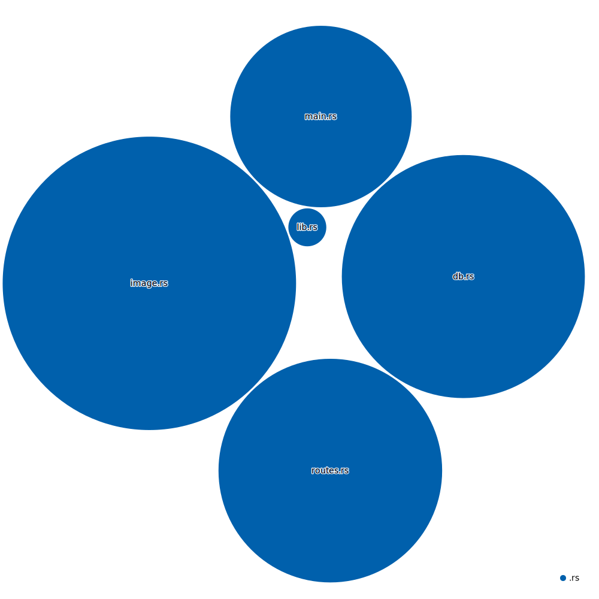

# Imagen

Imagen is concurrent image generating service for POK. His purpose is to lower POK latency by generating and optimizing the cards images a head of time

Version 1 is based on postgreSQL [LISTEN/NOTIFY](https://www.postgresql.org/docs/current/sql-notify.html) and Version 2 is based on [Actix web](https://www.postgresql.org/docs/current/sql-notify.html) for better concurrency

## Tech Stack

- [Rust](https://www.rust-lang.org/)

## Architecture



# Usage

either

```rust
cargo run
```

or use the docker compose that is in the main folder
